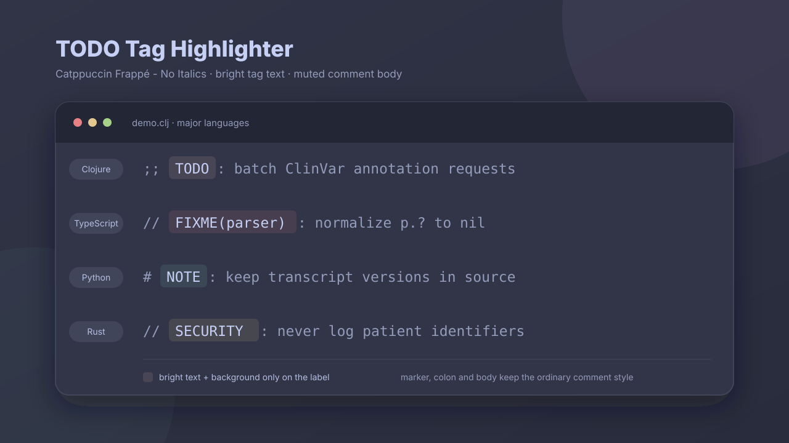

# TODO Tag Highlighter



Zedのコメント内にある `TODO`、`FIXME`、`NOTE`、`HACK` などについて、**タグ部分だけ**を明るい文字色と背景で強調し、それ以外のコメントは通常表示に保つlanguage extension。

```clojure
;; TODO: ClinVarの取得処理をbatch化する
;; ^^^^ この4文字だけ明るい文字色 + 背景色
```

- コメント記号は通常コメントのまま
- `:` と説明本文も通常コメントのまま
- `TODO(owner)` はownerを含むタグ部分だけ明るい文字色 + 背景色
- Clojure、JavaScript、TypeScript、Python、Rust、Java、Goなど主要言語に対応

## 現在のCatppuccin Frappé配色

タグ文字は白 `#fff`、背景はCatppuccin Frappéのアクセント色を100% alphaで表示する。コメント記号・コロン・本文は通常コメント色 `#949cbb` のまま。

| 種別 | Frappé color | `background_color` |
|---|---|---|
| TODO / task | Flamingo | `#eebebeff` |
| NOTE / info | Teal | `#81c8beff` |
| FIXME / fix | Red | `#e78284ff` |
| WARN / warning | Yellow | `#e5c890ff` |

タグ部分の `color` は全カテゴリ共通で `#fff`。`background_color` 末尾の `ff` は100% alphaを表す。タグ以外のコメント色は変更しない。

現在使っているテーマが `Catppuccin Frappé - No Italics` なので、設定例はその**完全一致名**を使用する。タグ文字は `#fff`、タグ以外のコメントはテーマ本来の `#949cbb`、`font_style` と `font_weight` は `null`。

## v0.3.0で直したこと

以前の版は `comment.todo` という一般的なcapture名を使っていた。多くのテーマがこの名前を「オレンジ文字」に割り当てているため、背景overrideが適用されていない環境では、**文字色だけ変わり、背景が付かない**状態になっていた。

v0.3.0ではテーマと衝突しにくい固有名へ変更した。

```text
comment.todo_tag_highlighter.task
comment.todo_tag_highlighter.info
comment.todo_tag_highlighter.fix
comment.todo_tag_highlighter.warning
```

背景設定がないテーマでは通常コメントへ戻り、古い `comment.todo` のオレンジ文字にはならない。背景を表示するには、使用中テーマ名と一致する `theme_overrides` も必要。

> [!IMPORTANT]
> Galleryの **Comments Highlighter**、旧Dev Extension `clojure-todo-highlighter`、v0.2.0以前の `todo-tag-highlighter` は外してからv0.3.3を入れ直す。

## インストール

### 1. Dev Extensionを入れる

1. ZIPを展開する。
2. Zedで `Cmd + Shift + X` を押す。
3. **Install Dev Extension** を押す。Command Paletteの `zed: install dev extension` でもよい。
4. `extension.toml` がある `todo-tag-highlighter` directoryを選ぶ。

自分だけで使う場合、GitHubやZed Galleryへの公開は不要。

### 2. 使用中テーマ用のタグ配色を入れる

Zedのsyntax queryはcapture名を返すだけで、extension側から任意テーマの文字色・背景色を直接決めることはできない。`settings.json` の `theme_overrides` に、使用中テーマ用のstyleを追加する。

#### Catppuccin Frappé - No Italics / Catppuccin Frappé / One Dark / One Light

他テーマ向けの設定例は [`examples/settings.theme-overrides.jsonc`](examples/settings.theme-overrides.jsonc) にある。現在使用中の `Catppuccin Frappé - No Italics` では、次のblockをZedの `settings.json` にmergeする。

```jsonc
{
  "theme_overrides": {
    "Catppuccin Frappé - No Italics": {
      "syntax": {
        "comment.todo_tag_highlighter.task": {
          "color": "#fff",
          "background_color": "#eebebeff",
          "font_style": null,
          "font_weight": null
        },
        "comment.todo_tag_highlighter.info": {
          "color": "#fff",
          "background_color": "#81c8beff",
          "font_style": null,
          "font_weight": null
        },
        "comment.todo_tag_highlighter.fix": {
          "color": "#fff",
          "background_color": "#e78284ff",
          "font_style": null,
          "font_weight": null
        },
        "comment.todo_tag_highlighter.warning": {
          "color": "#fff",
          "background_color": "#e5c890ff",
          "font_style": null,
          "font_weight": null
        }
      }
    }
  }
}
```

`"Catppuccin Frappé - No Italics"` の部分は**テーマ名との完全一致**が必要。通常のitalic版を使う場合は `"Catppuccin Frappé"` に変え、`font_style` も `"italic"` にする。

#### 使用中テーマを自動検出して生成する

macOS / Linux / Windowsの一般的なZed設定・extension保存先を検索し、使用中テーマのcomment styleを基礎にした設定を出力する。現在の白文字＋不透明背景を生成するには、`--tag-color '#fff'` と `--alpha 1.0` を指定する。

```bash
python3 scripts/generate_active_theme_overrides.py --appearance dark \
  --tag-color '#fff' \
  --alpha 1.0 \
  > /tmp/todo-tag-theme-overrides.json

cat /tmp/todo-tag-theme-overrides.json
```

出力された `theme_overrides` を、Zedの既存 `settings.json` にmergeする。script自体は設定ファイルを変更しない。オプションを省略した場合、generatorの背景paletteはCatppuccin Frappé、alphaは `0.12`、Frappéのタグ文字は `#c6d0f5ff`。その場合の背景色はtask `#eebebe1f`、info `#81c8be1f`、fix `#e782841f`、warning `#e5c8901f` になる。

使用中テーマ本来の `info` / `success` / `error` / `warning` 色へ戻す場合:

```bash
python3 scripts/generate_active_theme_overrides.py \
  --appearance dark \
  --palette theme
```

ライトテーマ側を生成する場合:

```bash
python3 scripts/generate_active_theme_overrides.py --appearance light
```

テーマを明示する場合:

```bash
python3 scripts/generate_active_theme_overrides.py \
  --theme "Ayu Mirage" \
  --theme-file /path/to/ayu-theme.json
```

テーマJSONを見つけられない場合は、通常コメント色を手動指定できる。

```bash
python3 scripts/generate_active_theme_overrides.py \
  --theme "Your Theme" \
  --comment-color '#707786ff'
```

タグ文字色だけ白にする場合:

```bash
python3 scripts/generate_active_theme_overrides.py \
  --appearance dark \
  --tag-color '#fff'
```

ブラウザ上で生成したい場合は [`docs/install-and-publish.html`](docs/install-and-publish.html) を開く。テーマ名・通常コメント色・タグ文字色・背景色を入力すると、その場でJSONを生成できる。

### 3. Zedを再読み込みしてdemoを開く

- Clojure: [`demo/demo.clj`](demo/demo.clj)
- 主要言語: [`demo/languages/`](demo/languages/)

Dev Extensionを更新した場合は、Extensions画面から入れ直すか、利用できる環境ではCommand Paletteの `zed: rebuild dev extension` を実行する。

## 正常時の表示

```clojure
;; FIXME(parser): p.? をnilに正規化する
```

| 部分 | 表示 |
|---|---|
| `;; ` | 通常のコメント |
| `FIXME(parser)` | 白文字 `#fff` + 不透明背景色 `#e78284ff` |
| `: p.? をnilに正規化する` | 通常のコメント |

固定している `tree-sitter-comment` grammarでは、コロンと本文が同じ `text` nodeになる。本文を通常コメントのままにするため、背景対象はタグ名と任意のownerまでに限定している。

## 文字色だけ変わる場合の確認

1. v0.3.3の `extension.toml` になっているか確認する。
2. Zedで `dev: open highlights tree view` を実行する。
3. `TODO` に `comment.todo_tag_highlighter.task` が付いていることを確認する。
4. `comment.todo` しか出ない場合、旧版または別のComments Highlighterが読み込まれている。
5. 固有captureが出ているのに背景がない場合、`theme_overrides` のテーマ名が現在のテーマと一致していない。
6. `semantic_tokens: "full"` の言語ではTree-sitter highlightが置き換えられるため、`off`または`combined`を使う。

`combined`でLSPのcomment tokenが上書きする場合は、[`examples/settings.semantic-tokens.jsonc`](examples/settings.semantic-tokens.jsonc) を参照。

## 対応タグ

タグは原則として大文字で、コメント行の先頭側に書く。

| 種別 | タグ | capture |
|---|---|---|
| タスク | `TODO` `WIP` `MAYBE` `QUESTION` `REVIEW` `?` | `comment.todo_tag_highlighter.task` |
| 情報 | `NOTE` `INFO` `DOCS` `PERF` `TEST` `IDEA` `XXX` `*` | `comment.todo_tag_highlighter.info` |
| 要修正 | `FIXME` `FIX` `BUG` `ERROR` `DELETE` `BROKEN` `!` | `comment.todo_tag_highlighter.fix` |
| 警告 | `HACK` `WARNING` `WARN` `SAFETY` `IMPORTANT` `SECURITY` `DEPRECATED` `NOCOMMIT` `#` | `comment.todo_tag_highlighter.warning` |

通常のコメント、文字列中の `TODO`、識別子に含まれる `TODO` は対象外。

## 対応言語

各language extensionがコメントnodeを非表示language `comment` へinjectionする仕組みを使う。

### 主なプログラミング言語

Bash、C、C++、C#、Clojure、D、Dart、Elixir、Erlang、Gleam、Go、Haskell、Haxe、Hexa、Java、JavaScript、Kotlin、Lua、Nim、PHP、Python、R、Ruby、Rust、Scala、Scheme、Swift、TypeScript、Zig。

### Web・設定・データ・文書

Astro、CSS、HTML、JSONC、JSON5、Svelte、TSX、Dockerfile、Make、Nix、OpenTofu/HCL、Terraform/HCL、TOML、YAML、AsciiDoc、LaTeX、RBS、SQL、Typst、Diff、Git Commit。

言語extensionが古い場合や、独自grammarが `comment` injectionを持たない場合は動かない。

## 任意テーマJSONから生成する

```bash
python3 scripts/generate_theme_overrides.py /path/to/theme.json --list
python3 scripts/generate_theme_overrides.py /path/to/theme.json --theme "Ayu Dark"
python3 scripts/generate_theme_overrides.py /path/to/theme.json --all > generated.json
```

背景の濃さは `--alpha` で調整できる。デフォルトは `0.12`。
上記の現在配色に合わせる場合は `--tag-color '#fff' --alpha 1.0` を追加する。

```bash
python3 scripts/generate_theme_overrides.py /path/to/theme.json \
  --theme "Ayu Dark" \
  --alpha 0.20
```

generatorは、テーマの `syntax.comment` からitalic・weightなどをcopyする。Catppuccin Frappéではタグ文字を `#c6d0f5` にし、Frappé系の `background_color` を追加する。選択テーマ固有のstatus色を使う場合は `--palette theme` を指定する。

## 仕組み

言語側の `injections.scm` がコメントnodeを `comment` languageへ渡す。

```scheme
((comment) @content
  (#set! injection.language "comment"))
```

タグ名には、通常コメントと固有captureの2つを付ける。

```scheme
(name) @comment @comment.todo_tag_highlighter.task
```

Zedは右側からstyleを探す。固有capture用styleが設定されていれば背景付きstyleを使い、なければ左側の `comment` にfallbackする。

## タグを追加する

[`languages/comment/highlights.scm`](languages/comment/highlights.scm) の `#match?` を編集する。

```scheme
(#match? @comment.todo_tag_highlighter.warning
  "^(HACK|WARNING|WARN|SECURITY|NOCOMMIT|BLOCKED|#)$")
```

## 公開について

自分だけで使うなら公開不要。Galleryへ公開する場合は、公開GitHub repository、license、`zed-industries/extensions` registryへのPull Requestが必要。

ローカル利用と公開手順は [`docs/install-and-publish.html`](docs/install-and-publish.html) に分けてまとめている。

## ディレクトリ構成

```text
todo-tag-highlighter/
├── extension.toml
├── languages/comment/
│   ├── config.toml
│   └── highlights.scm
├── demo/
│   ├── demo.clj
│   └── languages/
├── docs/
│   ├── demo.svg
│   ├── demo.png
│   └── install-and-publish.html
├── examples/
│   ├── README.md
│   ├── settings.custom-theme.template.jsonc
│   ├── settings.theme-overrides.jsonc
│   └── settings.semantic-tokens.jsonc
├── scripts/
│   ├── check.py
│   ├── generate_active_theme_overrides.py
│   └── generate_theme_overrides.py
├── LICENSE
└── README.md
```

## 検証

```bash
python3 scripts/check.py
```

manifest、TOML、query、demo、SVG、HTML、設定例、generatorを静的に確認する。最終的な描画確認はZedでDev Extensionを読み込んで行う。

## 参考資料

- Zed Language Extensions: https://zed.dev/docs/extensions/languages
- Zed Themes: https://zed.dev/docs/themes
- Zed Developing Extensions: https://zed.dev/docs/extensions/developing-extensions
- Zed Semantic Tokens: https://zed.dev/docs/semantic-tokens
- Zed Publishing Guide: https://zed.dev/docs/extensions/publishing/publishing-guide
- Comments Highlighter: https://github.com/thedadams/zed-comment
- tree-sitter-comment: https://github.com/thedadams/tree-sitter-comment
- Catppuccin Palette: https://catppuccin.com/palette/
- Catppuccin for Zed: https://github.com/catppuccin/zed
- Catppuccin Frappé - No Italics theme: https://github.com/catppuccin/zed/blob/main/themes/catppuccin-no-italics-mauve.json

## License

MIT。依存・参考projectの表示は [`THIRD_PARTY_NOTICES.md`](THIRD_PARTY_NOTICES.md) を参照。
